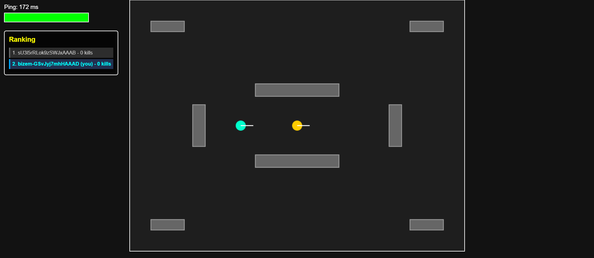

# Laser Tag Multiplayer

<div align="center">



[](https://www.typescriptlang.org/)
[](https://nodejs.org/)
[](https://expressjs.com/)
[](https://socket.io/)
[](https://developer.mozilla.org/en-US/docs/Web/HTML)
[](https://developer.mozilla.org/en-US/docs/Web/CSS)
[](https://developer.mozilla.org/en-US/docs/Web/API/Canvas_API)

A real-time multiplayer laser tag game with a dynamic obstacle system (walls).

</div>

## Table of Contents

- [Features](#features)
- [Tech Stack](#tech-stack)
- [Installation](#installation)
  - [Prerequisites](#prerequisites)
  - [Setup Instructions](#setup-instructions)
  - [Running Locally](#running-locally)
- [Game Mechanics](#game-mechanics)
- [Controls](#controls)
- [Improvements & Future Work](#improvements--future-work)
- [License](#license)

## Features

- ✅ Real-time multiplayer via WebSockets (Socket.IO)
- ✅ Collision system with walls
- ✅ Strategic wall obstacles
- ✅ Health and damage system
- ✅ Kills/scoring system
- ✅ Automatic respawn
- ✅ Circular-based physics and collision detection
- ✅ Particle effects system
- ✅ HUD with player stats and leaderboard
- ✅ Audio feedback system (Shoot, Death, Collect, Power-down, Join)
- ✅ Power-ups system (Shield, Invisibility, Speed)
- ✅ Interpolation and lag compensation
- ✅ Custom favicon and UI improvements

## Tech Stack

- **Backend**: Node.js + Express + Socket.IO + TypeScript
- **Frontend**: HTML5 Canvas + JavaScript (Vanilla)
- **Real-time Communication**: WebSockets (Socket.IO)
- **Build Tools**: TypeScript compiler, ts-node-dev
- **Package Manager**: npm

## Installation

### Prerequisites

Ensure you have the following installed on your system:

- **Node.js** (v16.0.0 or higher) - [Download](https://nodejs.org/)
- **npm** (v7.0.0 or higher) - Comes with Node.js
- **Git** - [Download](https://git-scm.com/)

### Setup Instructions

1. **Clone the repository**:

   ```bash
   git clone https://github.com/ImaCod3r/laser-tag-multiplayer.git
   cd laser-tag-multiplayer
   ```

2. **Install dependencies**:

   ```bash
   npm install
   ```

3. **Verify TypeScript installation** (optional):
   ```bash
   npx tsc --version
   ```

### Running Locally

#### Development Mode (with hot reload)

```bash
npm run dev
```

The server will start on `http://localhost:3000`. Open your browser and navigate to the URL. The server will automatically restart when you make changes to the TypeScript files.

#### Production Mode

1. **Build the project**:

   ```bash
   npm run build
   ```

2. **Start the server**:
   ```bash
   npm start
   ```

The compiled JavaScript will be in the `dist/` directory, and the server will run on `http://localhost:3000`.

#### Playing the Game

- Open the game URL in your browser (or share it with others on your network)
- Players will be automatically connected via WebSockets
- The game supports multiple simultaneous players
- Use the controls to move and shoot lasers

## Game Mechanics

### Walls/Obstacles

Walls are rectangular objects that serve as strategic obstacles on the map:

- **Block player movement** - Players cannot pass through walls
- **Block lasers** - Shots are stopped by walls, creating strategic cover points
- **Strategic positioning** - Walls are placed to create challenging and balanced gameplay
- **Optimized collision** - Circular-to-rectangular collision detection for smooth physics

### Scoring System

- **Hits**: Award points when you hit opponents
- **Kills**: Major points for eliminating players
- **Leaderboard**: Real-time ranking displayed on HUD
- **Respawn**: Automatic respawn after elimination with health regeneration

### Power-ups

Loot crates spawn periodically on the map, providing temporary advantages:

- **🛡️ Shield**: Extra protection and health recovery.
- **👻 Invisibility**: Makes the player nearly invisible to opponents (visual feedback provided to the user).
- **⚡ Speed**: Double movement speed for a short duration.
- **Audio Feedback**: Unique sounds for collection and when the effect expires.

## Controls

| Action     | Key                           |
| ---------- | ----------------------------- |
| Move Up    | `W` or `Arrow Up`             |
| Move Down  | `S` or `Arrow Down`           |
| Move Left  | `A` or `Arrow Left`           |
| Move Right | `D` or `Arrow Right`          |
| Shoot      | `Left Mouse Click` or `Space` |
| Aim        | `Mouse Movement`              |

## Improvements & Future Work

### High Priority

- [ ] **Improved Matchmaking** - Implement ELO rating system or skill-based matchmaking
- [ ] **Game Modes** - Add different game modes (Team Deathmatch, Capture the Flag, King of the Hill)
- [ ] **Map Editor** - Allow users to create and customize maps
- [ ] **Player Profiles** - User accounts with stats, customization options, and loadouts
- [ ] **Weapon Variety** - Different laser types (spread shot, sniper, pulse)

### Medium Priority

- [ ] **Mobile Support** - Touch controls for mobile and tablet devices
- [ ] **Spectator Mode** - Watch other players after elimination
- [ ] **Chat System** - In-game messaging between players
- [ ] **Sound Settings** - Volume control and audio preferences UI
- [ ] **Graphics Settings** - Resolution and performance optimization options
- [ ] **Replay System** - Record and playback match highlights

### Low Priority

- [ ] **AI Bots** - Single-player practice against AI opponents
- [ ] **Cosmetics** - Player skins, laser colors, trail effects
- [ ] **Achievements** - Badge system for reaching milestones
- [ ] **Tournaments** - Seasonal competitive events with rewards
- [ ] **Mod Support** - Community-created modifications and plugins
- [ ] **Analytics Dashboard** - Game statistics and performance metrics

### Technical Improvements

- [ ] **Code Optimization** - Reduce network bandwidth usage and optimize rendering
- [ ] **Error Handling** - Better error messages and disconnection recovery
- [ ] **Unit Tests** - Comprehensive test coverage for game logic
- [ ] **Documentation** - API documentation and architecture guide
- [ ] **Performance Monitoring** - Real-time FPS and latency display
- [ ] **Cross-platform Build** - Docker support for easier deployment

## License

This project is licensed under the MIT License - see the [LICENSE](LICENSE) file for details.

---

**Made with ❤️ by ImaCod3r**
